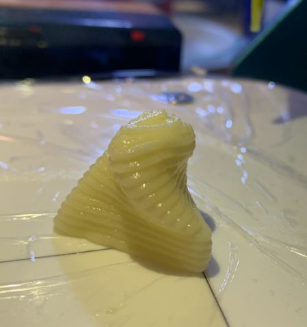

# food_printing

## 3D Printing Food Project
##### Goal: Familiarization with the low-level mechanics of digital manufacturing via 3D printing food. 
#### MECE 4606 Digital Manufacturing
#### Miranda Wang, McKenna Gillard, David D’Ambrisi, Yehuda Lehrfield
#### April, 2022


## Cream Cheese Square (Basic Test Print)

To learn how to use the food 3D printers, we first printed a basic one-inch square out of cream cheese.

### G-Code Emulator’s Simulated Path

We used the https://ncviewer.com/ G-Code emulator to simulate our square’s tool path. In the following images, the grey cylinder represents the tool. The images below are in sequence and represent the path the tool will take. The blue rectangle shows the path:


### One Inch Square G-Code
The G-Code used to generate the one-inch square of cream cheese is shown below.

```
T0                          (Choosing Extruder 1)
G21                         (units of mm)
G92 X0 Y0 Z0 E0             (set origin where printhead is)
G90                         (Absolute Positioning)
G1 E0.25                    (Extrude a bit)
G1 X0 Y25.4 Z0 E0.5 F200    
G1 X25.4 Y25.5 Z0 E0.5 F200
G1 X25.4 Y0 Z0 E0.5 F200
G1 X0 Y0 Z0 E0.5 F200       
G1 Z5 E-2 F200              (Retract plunger)
G1 X40 F400                 (move print head out of the way)
G28                         (Return to printer home)
```

### Photos of Best Print
The following pictures show our one-inch square of cream cheese. We also prove that the print is one inch. The last image attempts to show the quality of the print line.


Photo of the one-inch square made using cream cheese


Photo of one-inch square made using cream cheese


Close-up photo of the printed cream cheese

## Frosting Twisted Triangle
To prepare for the final print, we were tasked with creating a “twisted triangle”, a 3D structure that was composed of stacked triangles that were slightly rotated with each layer and decreasing in size with each layer. We made our own buttercream frosting and printed our twisted triangle out of it.

### G-Code Emulator’s Simulated Path
We used the Repetier (https://www.repetier.com/) G-Code emulator to simulate our twisted triangle tool path. In the following images, the teal lines show the tool path. The white circle represents the origin in the first image.


Angled view of our twisted triangle tool path (teal lines) created from the repetier G-Code emulator


Aerial view of our twisted triangle tool path (teal lines) created from the repetier G-Code emulator


Side view of our twisted triangle tool path (teal lines) created from the repetier G-Code emulator

### Twisted Triangle Source Code
Using a .py we created a python script which was used to generate the G-Code for the twisted triangle. The python script asks for a series of user inputs, and in return, a .gcode file is generated which can be used by the food printers available in Columbia’s Mechanical Engineering Lab. Our python script asks for users to input the side length (millimeters), height per layer (millimeters), side length change increment (in millimeters), degrees of rotation, whether a triangle is single or double, and a file name for the G-Code. The feed rate is automatically set at 200 mm/s and the extrusion is set at .5.

The script uses the printer head location chosen by the user as the origin. The origin then represents the center of the twisted triangle stack. Triangles are made and in each layer the three points that form the path rotate so that the triangle rotates the degree amount the user specifies.

Below are the inputs that were used to generate the G-Code we used for the frosting twisted triangle:

> Enter initial side length: 35
Enter height per layer: 1.25
Enter the side length change increment: .75
Enter the degrees of rotation: 5
Single (S) or Double (D) Triangle? s
Enter a file name (no extension): g_code_twisted_tri

### Twisted Triangle G-Code
The G-Code used to generate the twisted triangle of frosting is shown below.

```
T0
G21
G92 X0 Y0 Z0 E0
G90
G0 X50.0
G1 E0.25
G0 X0 Y0 Z0 E0
G1 X18.31399656849924 Y-8.539956851315555 Z0 E0.5 F200
G1 X-16.55281786471186 Y-11.590407847483597 Z0 E0.5 F200
G1 X-1.761178703787379 Y20.130364698799156 Z0 E0.5 F200
G1 Z1.25
G1 X18.581713724144034 Y-6.76319069724421 Z1.25 E0.5 F200
G1 X-15.147951816524095 Y-12.710640782336576 Z1.25 E0.5 F200
G1 X-3.433761907619939 Y19.473831479580788 Z1.25 E0.5 F200
G1 Z2.5
G1 X18.68219745014438 Y-5.005879719604964 Z2.5 E0.5 F200
G1 X-13.676317730539415 Y-13.676317730539411 Z2.5 E0.5 F200
G1 X-5.005879719604968 Y18.68219745014438 Z2.5 E0.5 F200
G1 Z3.75
G1 X18.620962947628342 Y-3.2833781744395045 Z3.75 E0.5 F200
G1 X-12.15397038311016 Y-14.484537868355153 Z3.75 E0.5 F200
G1 X-6.466992564518187 Y17.76791604279466 Z3.75 E0.5 F200
G1 Z5.0
G1 X18.404904867473515 Y-1.610220529177034 Z5.0 E0.5 F200
G1 X-10.596944317699293 Y-15.134004904879411 Z5.0 E0.5 F200
G1 X-7.807960549774224 Y16.74422543405645 Z5.0 E0.5 F200
G1 Z6.25
G1 X18.042195912175806 Y0 Z6.25 E0.5 F200
G1 X-9.021097956087912 Y-15.624999999999996 Z6.25 E0.5 F200
G1 X-9.0210979560879 Y15.625000000000002 Z6.25 E0.5 F200
G1 Z7.5
G1 X17.54217495181069 Y1.5347414418718517 Z7.5 E0.5 F200
G1 X-7.441962399003554 Y-15.95933986683505 Z7.5 E0.5 F200
G1 X-10.100212552807134 Y14.42459842496319 Z7.5 E0.5 F200
G1 Z8.75
G1 X16.915225883723462 Y2.982610708078626 Z8.75 E0.5 F200
G1 X-5.874596299066138 Y-16.140320680095915 Z8.75 E0.5 F200
G1 X-11.040629584657319 Y13.15770997201728 Z8.75 E0.5 F200
G1 Z10
G1 X16.172648538930957 Y4.333448115478917 Z10 E0.5 F200
G1 X-4.333448115478923 Y-16.172648538930954 Z10 E0.5 F200
G1 X-11.839200423452027 Y11.839200423452029 Z10 E0.5 F200
G1 Z11.25
G1 X15.326522998746537 Y5.578398166340119 Z11.25 E0.5 F200
G1 X-2.8322269748981976 Y-16.062357351771013 Z11.25 E0.5 F200
G1 X-12.494296023848337 Y10.483959185430901 Z11.25 E0.5 F200
G1 Z12.5
G1 X14.389568732392256 Y6.709966097462227 Z12.5 E0.5 F200
G1 X-1.3837832672615122 Y-15.81671512048505 Z12.5 E0.5 F200
G1 X-13.005785465130748 Y9.106749023022822 Z12.5 E0.5 F200
G1 Z13.75
G1 X13.375 Y7.722059850411245 Z13.75 E0.5 F200
G1 X0 Y-15.44411970082249 Z13.75 E0.5 F200
G1 X-13.375000000000002 Y7.722059850411244 Z13.75 E0.5 F200
G1 Z15
G1 X12.296378985214524 Y8.61001725813067 Z15 E0.5 F200
G1 X1.3083041799563335 Y-14.953985204822228 Z15 E0.5 F200
G1 X-13.60468316517086 Y6.343967946691559 Z15 E0.5 F200
G1 Z16.25
G1 X11.167468127510464 Y9.370618386978057 Z16.25 E0.5 F200
G1 X2.531459508537322 Y-14.356620287866129 Z16.25 E0.5 F200
G1 X-13.69892763604779 Y4.986001900888071 Z16.25 E0.5 F200
G1 Z17.5
G1 X10.002083116364647 Y10.002083116364643 Z17.5 E0.5 F200
G1 X3.6610165113528788 Y-13.663099627717532 Z17.5 E0.5 F200
G1 X-13.663099627717529 Y3.661016511352889 Z17.5 E0.5 F200
G1 Z18.75
G1 X8.813947987751643 Y10.504054179341521 Z18.75 E0.5 F200
G1 X4.689803768162048 Y-12.885129954698415 Z18.75 E0.5 F200
G1 X-13.503751755913683 Y2.381075775356891 Z18.75 E0.5 F200
G1 Z20
G1 X7.616553728346368 Y10.877566025382075 Z20 E0.5 F200
G1 X5.611971645150227 Y-12.03491203072807 Z20 E0.5 F200
G1 X-13.228525373496588 Y1.1573460053459914 Z20 E0.5 F200
G91
G1 Z10 E-2 F200
G1 X50.0 F400
G28
```

### Photos of Best Twisted Triangle Print



Angled view of our completed twisted triangle made of buttercream frosting


An aerial view of our completed twisted triangle made of buttercream frosting


An aerial view of the interior of our twisted triangle in progress

### Buttercream Frosting Recipe
Below is the frosting recipe that we used to create our twisted triangle:

> .25lb unsalted butter
.25lb powdered sugar
1 tsp vanilla extract
.25 tsp salt
1 tsp boiling water

> Whip butter and salt on high speed until white
Add sugar in thirds, scraping in between each addition
After the second addition, add the boiling water
Add vanilla extract and any additional flavorings at the end

## Two-Material Twisted Triangles
To prepare for the final print, we were also tasked with modifying our “twisted triangle” to incorporate two materials. The final 3D structure was composed of stacked triangles that were slightly rotated and decreasing in size with each layer. Every few layers (user-defined), a material change occurs such that the subsequent layer(s) is/are printed with the other material. We printed our two-material twisted triangle pyramid out of cream cheese and chocolate frosting.

### G-Code Simulated Path
We used the NC Viewer G-Code simulator to simulate our twisted triangle tool path. In the following image, the blue lines show the tool path. The second and third images show different top and side views in NC Viewer. Because the simulator treats tool changes as if they occur from the same point (i.e. no offset in the x- or y- direction), the resultant simulations appear as stacked groups of triangles offset in the x-direction from each other by the distance between the two extruders. As is shown the images below, this gcode represents a material (tool) change every three layers.


Angled view of our twisted triangle tool path (blue lines) created from the NC Viewer G-Code simulator


Aerial view of our twisted triangle tool path (blue lines) created from the NC Viewer G-Code simulator


Side view of our twisted triangle tool path (blue lines) created from the NC Viewer G-Code simulator

### Two Material Twisted Triangle Source Code
Using a .py we created a python script which was used to generate the G-Code for the twisted triangle. The python script asks for a series of user inputs and generates a .gcode file which can be used by the food printers available in Columbia’s Mechanical Engineering Lab. Our python script asks for users to input the base side length of an equilateral triangle (millimeters), the height per layer (millimeters), the side length change decrement (in millimeters), the rotation per layer (degrees), whether a triangle layer is single or double (for added stability), the number of materials (1 or 2), how (every ith layer) often a material change (i.e. tool switch) occurs and a file name for the G-Code file. The feed rate is automatically set for both materials at 200 mm/s and the extrusion amount is set at .5.

The script uses the printer head location chosen by the user as the origin. The origin plus 50 mm in both the x and y axes then represents the center of the twisted triangle stack. We added this offset to ensure no triangle vertices are ever negative. Triangles are made by calculating the location of each vertex relative to the offsetted origin of a circumscribed circle (around the equilateral triangle). For every subsequent layer, the vertices are shifted inward to decrease the size of the triangle and rotated by the specified angle to create the pyramid effect.

Below are the inputs that were used to generate the G-Code we used for the frosting twisted triangle:

> Enter initial side length: 35
Enter height (mm) per layer (nominal = 1.25): .65
Enter the side length decrement (mm, nominal = .75) .75
Enter the degrees of rotation: 1
Single (S) or Double (D) Triangle? s
One (1) or Two (2) Materials? 2
Enter the ith layer to switch materials: 3
Enter a file name (no extension): twoMaterialTwistedTriangle

### Two-Material Twisted Triangle G-Code
The G-Code resulting in the twisted triangle of frosting is shown below.

```
T0
G21
G92 X0 Y0 Z0 E0
G90
G0 X160.0
G1 E0.25
G1 X160.0 E0
T1
G1 E0.25
G1 X160.0 E0
T0
G0 X0 Y0 Z0 E0
G1 X67.67366731744187 Y40.203326233577 Z0 E0.5 F200
G1 X32.67899798696817 Y39.592492008272075 Z0 E0.5 F200
G1 X49.64733469558997 Y70.20418175815092 Z0 E0.5 F200
G1 Z0.65
G1 X67.4596235417971 Y40.71655348956769 Z0.65 E0.5 F200
G1 X33.23048771639307 Y39.521245727507036 Z0.65 E0.5 F200
G1 X49.30988874180983 Y69.76220078292528 Z0.65 E0.5 F200
G1 Z1.3
G1 X67.23316569576055 Y41.219263502655636 Z1.3 E0.5 F200
G1 X33.77907628148232 Y39.466008968517016 Z1.3 E0.5 F200
G1 X48.987758022757134 Y69.31472752882735 Z1.3 E0.5 F200
G1 Z1.9500000000000002
T1
G1 X49.244596744892064 Y41.71118133798082 Z1.9500000000000002 E0.5 F200
G1 X16.57437409888282 Y39.42665682286073 Z1.9500000000000002 E0.5 F200
G1 X30.931029156225108 Y68.86216183915845 Z1.9500000000000002 E0.5 F200
G1 Z2.6
G1 X48.994225434056446 Y42.19203945022578 Z2.6 E0.5 F200
G1 X17.11599509512058 Y39.40305568230071 Z2.6 E0.5 F200
G1 X30.63977947082297 Y68.40490486747352 Z2.6 E0.5 F200
G1 Z3.25
G1 X48.732366121466114 Y42.66157780096569 Z3.25 E0.5 F200
G1 X17.653556891207565 Y39.39506332385152 Z3.25 E0.5 F200
G1 X30.36407698732632 Y67.9433588751828 Z3.25 E0.5 F200
G1 Z3.9
T0
G1 X66.20933861039927 Y43.11954397247152 Z3.9 E0.5 F200
G1 X35.936680985338946 Y39.40252899861452 Z3.9 E0.5 F200
G1 X47.8539804042618 Y67.47792702891395 Z3.9 E0.5 F200
G1 Z4.55
G1 X65.92546797866669 Y43.56569327792065 Z4.55 E0.5 F200
G1 X36.46499293360496 Y39.42529352435871 Z4.55 E0.5 F200
G1 X47.60953908772835 Y67.00901319772063 Z4.55 E0.5 F200
G1 Z5.2
G1 X65.63108440590142 Y43.9997888679715 Z5.2 E0.5 F200
G1 X36.988122528642435 Y39.46318938180482 Z5.2 E0.5 F200
G1 X47.38079306545614 Y66.53702175022367 Z5.2 E0.5 F200
G1 Z5.8500000000000005
T1
G1 X47.57652299874654 Y44.421601833659885 Z5.8500000000000005 E0.5 F200
G1 X19.75570397615166 Y39.5160408145691 Z5.8500000000000005 E0.5 F200
G1 X29.417773025101802 Y66.06235735177101 Z5.8500000000000005 E0.5 F200
G1 Z6.500000000000001
G1 X47.26212361401657 Y44.83091130557625 Z6.500000000000001 E0.5 F200
G1 X20.26737606920581 Y39.58366393272127 Z6.500000000000001 E0.5 F200
G1 X29.22050031677762 Y65.58542476170248 Z6.500000000000001 E0.5 F200
G1 Z7.150000000000001
G1 X46.93823067990959 Y45.227504549284916 Z7.150000000000001 E0.5 F200
G1 X20.772782360280285 Y39.66586681990986 Z7.150000000000001 E0.5 F200
G1 X29.038986959810128 Y65.10662863080522 Z7.150000000000001 E0.5 F200
G1 Z7.800000000000002
T0
G1 X64.35519301534703 Y45.61117705694735 Z7.800000000000002 E0.5 F200
G1 X39.02157133093091 Y39.762449644006864 Z7.800000000000002 E0.5 F200
G1 X46.62323565372206 Y64.62637329904578 Z7.800000000000002 E0.5 F200
G1 Z8.450000000000001
G1 X64.01336364751953 Y45.98173263511356 Z8.450000000000001 E0.5 F200
G1 X39.51339655905062 Y39.87320477122194 Z8.450000000000001 E0.5 F200
G1 X46.47323979342985 Y64.1450625936645 Z8.450000000000001 E0.5 F200
G1 Z9.100000000000001
G1 X63.66309962771753 Y46.338983488647116 Z9.100000000000001 E0.5 F200
G1 X39.997916883635355 Y39.997916883635355 Z9.100000000000001 E0.5 F200
G1 X46.338983488647116 Y63.66309962771753 Z9.100000000000001 E0.5 F200
G1 Z9.750000000000002
T1
G1 X45.554761845526016 Y46.68275030075085 Z9.750000000000002 E0.5 F200
G1 X22.72479656699094 Y40.136363100097114 Z9.750000000000002 E0.5 F200
G1 X28.47044158748305 Y63.18088659915203 Z9.750000000000002 E0.5 F200
G1 Z10.400000000000002
G1 X45.18871484146358 Y47.01286230906182 Z10.400000000000002 E0.5 F200
G1 X23.19370545431376 Y40.288313100438884 Z10.400000000000002 E0.5 F200
G1 X28.36757970422266 Y62.69882459049929 Z10.400000000000002 E0.5 F200
G1 Z11.050000000000002
G1 X44.8153266181464 Y47.32915737778599 Z11.050000000000002 E0.5 F200
G1 X23.654319130579232 Y40.45352925294341 Z11.050000000000002 E0.5 F200
G1 X28.280354251274375 Y62.21731336927059 Z11.050000000000002 E0.5 F200
G1 Z11.700000000000003
T0
G1 X62.18496845005831 Y47.631482065844324 Z11.700000000000003 E0.5 F200
G1 X41.856319074672996 Y40.631766745015454 Z11.700000000000003 E0.5 F200
G1 X45.958712475268705 Y61.73675118914023 Z11.700000000000003 E0.5 F200
G1 Z12.350000000000003
G1 X61.7980146920088 Y47.919691691003976 Z12.350000000000003 E0.5 F200
G1 X42.2993928107012 Y40.82277371699635 Z12.350000000000003 E0.5 F200
G1 X45.90259249729 Y61.25753459199967 Z12.350000000000003 E0.5 F200
G1 Z13.000000000000004
G1 X61.404842586361156 Y48.19365038996975 Z13.000000000000004 E0.5 F200
G1 X42.73323405641711 Y41.02629139906375 Z13.000000000000004 E0.5 F200
G1 X45.861923357221734 Y60.7800582109665 Z13.000000000000004 E0.5 F200
G1 Z13.650000000000004
T1
G1 X43.25583206911335 Y48.45323117441246 Z13.650000000000004 E0.5 F200
G1 X25.4075428687027 Y41.242054251156155 Z13.650000000000004 E0.5 F200
G1 X28.086625062183955 Y60.30471457443139 Z13.650000000000004 E0.5 F200
G1 Z14.300000000000004
G1 X42.85136557491502 Y48.698315982912895 Z14.300000000000004 E0.5 F200
G1 X25.822025786044875 Y41.46979010586133 Z14.300000000000004 E0.5 F200
G1 X28.076608639040103 Y59.831893911225784 Z14.300000000000004 E0.5 F200
G1 Z14.950000000000005
G1 X42.44182784110383 Y48.928795728801354 Z14.950000000000005 E0.5 F200
G1 X26.22639596794766 Y41.7092203142059 Z14.950000000000005 E0.5 F200
G1 X28.08177619094851 Y59.36198395699275 Z14.950000000000005 E0.5 F200
G1 Z15.600000000000005
T0
G1 X59.77760571084531 Y49.1445703438747 Z15.600000000000005 E0.5 F200
G1 X44.370373331222254 Y41.960059894282814 Z15.600000000000005 E0.5 F200
G1 X45.852020957932446 Y58.89536976184249 Z15.600000000000005 E0.5 F200
G1 Z16.250000000000004
G1 X59.359087935460295 Y49.34554881797429 Z16.250000000000004 E0.5 F200
G1 X44.75368468309884 Y42.22201768265178 Z16.250000000000004 E0.5 F200
G1 X45.887227381440866 Y58.43243349937393 Z16.250000000000004 E0.5 F200
G1 Z16.900000000000002
G1 X58.93666497602459 Y49.53164923441001 Z16.900000000000002 E0.5 F200
G1 X45.12606385110489 Y42.494796488447044 Z16.900000000000002 E0.5 F200
G1 X45.93727117287052 Y57.97355427714294 Z16.900000000000002 E0.5 F200
G1 Z17.55
T1
G1 X40.76072880432548 Y49.70279880121738 Z17.55 E0.5 F200
G1 X27.737251809656314 Y42.77809325012548 Z17.55 E0.5 F200
G1 X28.2520193860182 Y57.519107948657144 Z17.55 E0.5 F200
G1 Z18.2
G1 X40.331672703260374 Y49.85893387823599 Z18.2 E0.5 F200
G1 X28.08699680330883 Y43.07159919478727 Z18.2 E0.5 F200
G1 X28.331330493430798 Y57.069466926976745 Z18.2 E0.5 F200
G1 Z18.849999999999998
G91
T0
G1 Z10 E-2 F200
T1
G1 E-2
G1 X50.0 F400
G28
```

### Photos of Best Print


Angled view of our completed twisted triangle made of cream cheese and chocolate frosting


An aerial view of our completed twisted triangle made of cream cheese and chocolate frosting


An angled view of the interior of our two-material twisted triangle in progress

# Intricate Shape: Ravioli Redefined
The final print we decided upon was a 3-material design in which we were looking to create an intricately shaped individual ravioli. To do so, we used a base material of custom pasta dough to create a pocket for a cream cheese and red pepper filling. We garnished the ravioli by topping it with a spirographic layer of tomato basil paste. The basic design is a flower type pattern with petals that can rotate (user defined rotation increment) around a base circle which is filled with cheese/tomato filling, then covered with another layer of pasta dough. Finally, a design of woven arcs is printed in tomato paste above the entire part.

### G-Code Simulated Path
We used the NC Viewer G-Code simulator to simulate our printed Ravioli. In the first image, the blue lines show the tool path. The second and third images show different top and side views in NC Viewer. Because the simulator treats tool changes as if they occur from the same point (i.e. no offset in the x- or y- direction), the resultant simulation for the filling (extruding from extruder 2) appears as an offset set of concentric circles. The full g-code simulation in NC Viewer is shown in the first image below.


Isometric and top views of NC Viewer Ravioli Redefined Simulation

The print was constructed in five steps:
1. The base print for the entire ravioli structure
2. The walls of the ravioli
3. The filling
4. The cover for the ravioli
5. The design on top of the cover


Isometric and top views of NC Viewer Simulation of the Ravioli Base.


Isometric and top views of NC Viewer Simulation of the Ravioli Base and Walls.

Because the filling was in the second extruder, the simulation is offset by the distance between the extruders. The filling is several layers of concentric circles without raising the height of the printhead. This is depicted in the image below.


 Isometric and top views of NC Viewer Simulation of the Ravioli Base, Walls and Filling.

 The image below shows the next step of the print, the cover above the filling.

 

Isometric and top views of NC Viewer Simulation of the Ravioli Base, Walls, Filling and Cover.

The design above the entire ravioli structure was created by a few simple arcs. The pattern for the spiral pattern above the raviolis is shown in the image below.


### Ravioli Redefined Source Code Description
Using a .py file we created a python script which was used to generate the G-Code for our custom ravioli shape. The python script generates a .gcode file with its name specified by the user which can be used by the food printers available in Columbia’s Mechanical Engineering Lab.

The script uses the printer head location chosen by the user as the origin. The origin plus 50 mm in both the x and y axes then represents the “offset origin”. We added this offset to ensure no points for ravioli creation were ever negative.

#### Overview
Our .py script allows the user to define the overall size of the print, as well as specifics, such as the number of petals, the radius of the petals, the layer height, rotation amount and the size decrement (for pyramid effect). An example of user input is shown below.

> Enter base diameter (mm) of print area: 50
> Enter the radius (mm) for each petal: 13
> Enter the number of petals for the base6
> Enter height (mm) per layer: 1
> Enter the distance (mm) decrement (nominal = .75)
> For no decremental change, enter 0: 0
> Enter the number of layers for the base: 1
> Enter the number of layers for the walls: 10
> Enter the degrees of rotation: 3
> Enter a file name (no extension): ravioliRedefined

In order to generate the g-code in a .py, we created several functions to allow for modular testing and troubleshooting throughout the process. As described above, the printing was broken down into five parts:
1. Base
2. Walls
3. Filling
4. Cover
5. Spirograph Design

The `main()` function of the python script calls two functions: one function to fill in a text array of gcode commands (`fillLines()`) and a second function to write the contents of the array to a file with a .gcode extension (`writeToFile()`). The `fillLines()` function first intializes the printer and primes the nozzles, then calls five other functions - each to print one part of the ravioli. These functions are described below.

#### Base Print Function (basePrint)
The function used to print the base takes in arguments for the initial size of the base (as a diameter), the number of petals around the base diameter, the radius of all petals, the number of layers for the base, the height increment per layer, extrusion amount (overridden later, if necessary), feed rate, and the (initial) height. In order to print concentric circles to fill the base area, we used G3 gcode commands of decreasing I offsets (J offset remaining constant). For each iteration of a smaller circle, we changed the extrusion amount so that the amount extruded per unit length of print was constant. The petals were created by using trigonometry to locate the points on the base diameter where each petal began and ended and using G3 gcode commands to draw arcs from point to point. A constant extrusion amount was used for each petal, as they are all the same length.

#### Wall Print Function (wallPrint)
The wall print function is responsible for creating the cylindrical walls to hold the filling as well as printing petals that surround the cylindrical walls and rotate with each layer. Similar to the base print function, the walls print function takes as arguments the base diameter, the radius of petals, the number of petals, the incremental height per layer, extrusion amount, feed rate, and the current height. The cylindrical walls were created using a simple G3 command with I and J offsets sized for the base radius of the print. The petals were created using a similar technique as for the base print. However, in the walls function, the location of the petals can be rotated with each increasing layer. Different extrusion amounts were used for the printing of the larger circles for the cylindrical walls and for the petals.

#### Filling Print Function (fillingPrint)
The function for filling the interior of the ravioli with cheese-red pepper spread was composed of a series of concentric circles, similar to that of the base print function. The filling print function takes the same arguments as the base print function, but without petal size and number parameters. To fill the interior, the printhead is kept at a constant height and concentric circles are drawn, using G3 commands with an initial radius smaller than the radius of the base circle of the ravioli. To ensure that the nozzle of the second extruder did not interfere with the pattern of the pasta walls, we snipped off a small portion of the second nozzle. This allowed for the tool to pass with clearance above the walls. We modified the extrusion amount for the filling to compensate for the smaller nozzle size.

#### Cover Print Function (topPrint)
The cover print function is almost identical to the base print function, with the exception that the cover print function only printed concentric circles and no petals. The cover print function takes the same arguments as the filling function.

#### Spirograph Print Function (top_Spiro)
The spirograph on the top of the ravioli was created by drawing inverted arcs on the top of the ravioli cover. The arcs begin and end on the outer radius of the base circle for the ravioli. Two layers of the spirograph are printed with the second layer rotated by 25 degrees from the first. The result was an aesthetically simple but pleasing design. The spirograph function takes as arguments, the base radius , the number of petals, the radius of the petals and the current height.  

### Printing Calibration
We performed calibration tests on the materials we would be using in these prints to determine the appropriate feed rates, extrusion amounts, and height increases per layer. One such calibration was through a code printing lines at various speed and extrusion rates to determine the most optimal print parameters for the pasta dough, as shown in the image below. It was especially important to find printing parameters that allowed for sturdy but still delicate lines of pasta dough to act as the retaining walls of the structure.


Calibration testing print with varied printing rates in pasta dough

We also performed tests by breaking down each element of the ravioli and individual printing them with various parameters to determine the best methods. One such example was also performed on the cheese filling while experimenting with our floral spirographic decorative print. Running this G-Code in the cheese filling allowed us to see how well the cheese printed while ensuring the radii selected for this floral spirograph worked well on the 3d printers.


We also needed to ensure that when we were refilling a syringe with more of a material that we would be maintaining the same angle and orientation of the syringe. This was particularly important in printing the walls and petals of the ravioli, as this required three full syringes of pasta dough and would need to be refilled while the print is paused. We ran many tests in frosting (as we had limited pasta dough to test in) and determined that the best way to ensure this remained constant was to cut the top sides of the syringe so that they each fit into the slots in the same way and reuse the same syringe tips. The results of this calibration can be seen in the image below, where we paused the print halfway through printing the layers of the walls and petals and refilled the syringe with frosting. There is no noticeable change in orientation or offset.


Calibration results of refilling syringes during a print

Other important modes of calibration were done to ensure that we had an appropriate offset measured when implementing a tool change. This was important as T1 would contain the cheese filling that would need to be deposited in concentric circles within the ravioli walls. We would measure the offset of the two syringe tips with calipers for an accurate offset distance and used the other calibration techniques mentioned above (ensuring the syringe was all the way down into the holder and cutting the side of the syringe for a constant fit) to make sure that this number was consistent even through syringe refills.

### Calibration Source Code

```
The calibration code used to generate the test print shown in Figure 7 is shown below.

FR = [100,125,150,175,200,225,250]
EX = [.1,.15,.2,.25,.3,.35,.4,.45,.5,.55,.6,.65]
length = 10
moveRight = 2
moveDown = 5
lines = []
eol = "\n"


lines.append("T0" + eol)  # Select extruder 0
lines.append("G21"+ eol) # Set units to mm
lines.append("G92 X0 Y0 Z0 E0" + eol) # Set current position to be the origin
lines.append("G91"+ eol) # Set relative position commands


for f in range(len(FR)):
  for e in range(len(EX)):
    lines.append(f"G1 X0 Y{-length} F{FR[f]} E{EX[e]}" + eol)
    lines.append(f"G1 X{length} Y0 F{FR[f]} E{EX[e]}" + eol)
    lines.append(f"G1 X{moveRight} Y{length} F{FR[f]}" + eol)
  lines.append(f"G1 X{-12*length - 12*moveRight} Y{-2*length - moveDown} F{FR[f]}" + eol)


lines.append("G1 Z10 F400" + eol)


with open("printRateTemplate.gcode", 'w') as f:
  f.writelines(lines)
```

### Ravioli G-Code
The G-Code generated by our source-code for printing the intricate ravioli is shown below.

```
T0
G21
G92 X0 Y0 Z0 E0
G90
G0 X150.0
G1 E0.25
G1 X150.0 E0
T1
G1 E0.25
G1 X150.0 E0
T0
G0 X0 Y0 Z0 E0
G1 X75.0 Y50 Z0
G2 X75.0 Y50 I-25.0 J0 Z0 E5 F200
G1 X73.0 Y50 Z0
G2 X73.0 Y50 I-23.0 J0 Z0 E4.565217391304348 F200
G1 X71.0 Y50 Z0
G2 X71.0 Y50 I-21.0 J0 Z0 E4.130434782608695 F200
G1 X69.0 Y50 Z0
G2 X69.0 Y50 I-19.0 J0 Z0 E3.695652173913043 F200
G1 X67.0 Y50 Z0
G2 X67.0 Y50 I-17.0 J0 Z0 E3.2608695652173907 F200
G1 X65.0 Y50 Z0
G2 X65.0 Y50 I-15.0 J0 Z0 E2.826086956521739 F200
G1 X63.0 Y50 Z0
G2 X63.0 Y50 I-13.0 J0 Z0 E2.3913043478260865 F200
G1 X61.0 Y50 Z0
G2 X61.0 Y50 I-11.0 J0 Z0 E1.9565217391304346 F200
G1 X59.0 Y50 Z0
G2 X59.0 Y50 I-9.0 J0 Z0 E1.5217391304347825 F200
G1 X57.0 Y50 Z0
G2 X57.0 Y50 I-7.0 J0 Z0 E1.0869565217391304 F200
G1 X55.0 Y50 Z0
G2 X55.0 Y50 I-5.0 J0 Z0 E0.6521739130434782 F200
G1 X53.0 Y50 Z0
G2 X53.0 Y50 I-3.0 J0 Z0 E0.21739130434782605 F200
G1 Z3
G1 X75.0 Y50 Z3 E0.2
G1 Z0 E0.2
G3 X62.5 Y71.65063509461096 R13 Z0 E0.35 F200
G3 X37.50000000000001 Y71.65063509461098 R13 Z0 E0.35 F200
G3 X25.0 Y50.0 R13 Z0 E0.35 F200
G3 X37.499999999999986 Y28.34936490538904 R13 Z0 E0.35 F200
G3 X62.499999999999986 Y28.349364905389024 R13 Z0 E0.35 F200
G3 X75.0 Y49.99999999999999 R13 Z0 E0.35 F200
G1 Z1
G1 X75.0 Y50 Z1
G2 X75.0 Y50 I-25.0 J0 Z1 E5 F200
G3 X62.5 Y71.65063509461096 R13 Z1 E0.35 F200
G3 X37.50000000000001 Y71.65063509461098 R13 Z1 E0.35 F200
G3 X25.0 Y50.0 R13 Z1 E0.35 F200
G3 X37.499999999999986 Y28.34936490538904 R13 Z1 E0.35 F200
G3 X62.499999999999986 Y28.349364905389024 R13 Z1 E0.35 F200
G3 X75.0 Y49.99999999999999 R13 Z1 E0.35 F200
G3 X62.500000000000014 Y71.65063509461096 R13 Z1 E0.35 F200
G1 Z2
G1 X87.5 Y50 Z2
G1 X75.0 Y50 Z2
G2 X75.0 Y50 I-25.0 J0 Z2 E5 F200
G3 X62.120240506158424 Y71.8654926784849 R13 Z2 E0.35 F200
G3 X37.124048127248656 Y71.42918251755282 R13 Z2 E0.35 F200
G3 X25.003807621090218 Y49.56368983906792 R13 Z2 E0.35 F200
G3 X37.87975949384156 Y28.134507321515112 R13 Z2 E0.35 F200
G3 X62.87595187275134 Y28.57081748244718 R13 Z2 E0.35 F200
G3 X74.99619237890978 Y50.436310160932074 R13 Z2 E0.35 F200
G3 X62.120240506158446 Y71.86549267848488 R13 Z2 E0.35 F200
G1 Z3
G1 X87.5 Y50 Z3
G1 X75.0 Y50 Z3
G2 X75.0 Y50 I-25.0 J0 Z3 E5 F200
G3 X61.73678906964727 Y72.07368982147317 R13 Z3 E0.35 F200
G3 X36.75201839416988 Y71.20120240391066 R13 Z3 E0.35 F200
G3 X25.015229324522608 Y49.127512582437475 R13 Z3 E0.35 F200
G3 X38.26321093035271 Y27.926310178526837 R13 Z3 E0.35 F200
G3 X63.2479816058301 Y28.798797596089333 R13 Z3 E0.35 F200
G3 X74.98477067547739 Y50.87248741756251 R13 Z3 E0.35 F200
G3 X61.73678906964729 Y72.07368982147315 R13 Z3 E0.35 F200
G1 Z4
G1 X87.5 Y50 Z4
G1 X75.0 Y50 Z4
G2 X75.0 Y50 I-25.0 J0 Z4 E5 F200
G3 X61.34976249348867 Y72.2751631047092 R13 Z4 E0.35 F200
G3 X36.38402412462433 Y70.9667641986356 R13 Z4 E0.35 F200
G3 X25.034261631135653 Y48.69160109392641 R13 Z4 E0.35 F200
G3 X38.65023750651133 Y27.724836895290807 R13 Z4 E0.35 F200
G3 X63.61597587537567 Y29.033235801364395 R13 Z4 E0.35 F200
G3 X74.96573836886435 Y51.3083989060736 R13 Z4 E0.35 F200
G3 X61.349762493488676 Y72.2751631047092 R13 Z4 E0.35 F200
G1 Z5
G1 X87.5 Y50 Z5
G1 X75.0 Y50 Z5
G2 X75.0 Y50 I-25.0 J0 Z5 E5 F200
G3 X60.959278669726935 Y72.46985115747918 R13 Z5 E0.35 F200
G3 X36.02017741323133 Y70.72593931387604 R13 Z5 E0.35 F200
G3 X25.060898743504396 Y48.25608815639687 R13 Z5 E0.35 F200
G3 X39.04072133027306 Y27.53014884252083 R13 Z5 E0.35 F200
G3 X63.979822586768655 Y29.27406068612395 R13 Z5 E0.35 F200
G3 X74.9391012564956 Y51.74391184360313 R13 Z5 E0.35 F200
G3 X60.95927866972694 Y72.46985115747917 R13 Z5 E0.35 F200
G1 Z6
G1 X87.5 Y50 Z6
G1 X75.0 Y50 Z6
G2 X75.0 Y50 I-25.0 J0 Z6 E5 F200
G3 X60.56545654351749 Y72.65769467591625 R13 Z6 E0.35 F200
G3 X35.660589091223855 Y70.4788011072248 R13 Z6 E0.35 F200
G3 X25.09513254770636 Y47.82110643130855 R13 Z6 E0.35 F200
G3 X39.4345434564825 Y27.342305324083757 R13 Z6 E0.35 F200
G3 X64.33941090877613 Y29.521198892775192 R13 Z6 E0.35 F200
G3 X74.90486745229364 Y52.17889356869144 R13 Z6 E0.35 F200
G3 X60.5654565435175 Y72.65769467591625 R13 Z6 E0.35 F200
G1 Z7
G1 X87.5 Y50 Z7
G1 X75.0 Y50 Z7
G2 X75.0 Y50 I-25.0 J0 Z7 E5 F200
G3 X60.168416076895014 Y72.83863644106502 R13 Z7 E0.35 F200
G3 X35.30536869268818 Y70.22542485937369 R13 Z7 E0.35 F200
G3 X25.136952615793167 Y47.38678841830866 R13 Z7 E0.35 F200
G3 X39.83158392310498 Y27.161363558934987 R13 Z7 E0.35 F200
G3 X64.69463130731181 Y29.774575140626297 R13 Z7 E0.35 F200
G3 X74.86304738420684 Y52.613211581691324 R13 Z7 E0.35 F200
G3 X60.16841607689503 Y72.838636441065 R13 Z7 E0.35 F200
G1 Z8
G1 X87.5 Y50 Z8
G1 X75.0 Y50 Z8
G2 X75.0 Y50 I-25.0 J0 Z8 E5 F200
G3 X59.76827821223185 Y73.01262133631101 R13 Z8 E0.35 F200
G3 X34.9546244211988 Y69.96588775118232 R13 Z8 E0.35 F200
G3 X25.18634620896695 Y46.953266414871315 R13 Z8 E0.35 F200
G3 X40.23172178776815 Y26.987378663688993 R13 Z8 E0.35 F200
G3 X65.0453755788012 Y30.034112248817674 R13 Z8 E0.35 F200
G3 X74.81365379103305 Y53.04673358512869 R13 Z8 E0.35 F200
G3 X59.76827821223185 Y73.01262133631101 R13 Z8 E0.35 F200
G1 Z9
G1 X87.5 Y50 Z9
G1 X75.0 Y50 Z9
G2 X75.0 Y50 I-25.0 J0 Z9 E5 F200
G3 X59.365164835397806 Y73.17959636416968 R13 Z9 E0.35 F200
G3 X34.608463116858545 Y69.70026884016805 R13 Z9 E0.35 F200
G3 X25.243298281460742 Y46.52067247599836 R13 Z9 E0.35 F200
G3 X40.634835164602194 Y26.820403635830317 R13 Z9 E0.35 F200
G3 X65.39153688314144 Y30.299731159831943 R13 Z9 E0.35 F200
G3 X74.75670171853926 Y53.47932752400163 R13 Z9 E0.35 F200
G3 X59.365164835397806 Y73.17959636416968 R13 Z9 E0.35 F200
G1 Z10
G1 X87.5 Y50 Z10
G1 X75.0 Y50 Z10
G2 X75.0 Y50 I-25.0 J0 Z10 E5 F200
G3 X58.95919873863251 Y73.33951066243004 R13 Z10 E0.35 F200
G3 X34.266990223754064 Y69.42864903642428 R13 Z10 E0.35 F200
G3 X25.307791485121555 Y46.08913837399423 R13 Z10 E0.35 F200
G3 X41.040801261367484 Y26.66048933756996 R13 Z10 E0.35 F200
G3 X65.73300977624592 Y30.571350963575718 R13 Z10 E0.35 F200
G3 X74.69220851487844 Y53.91086162600577 R13 Z10 E0.35 F200
G3 X58.95919873863252 Y73.33951066243003 R13 Z10 E0.35 F200
G1 Z11
G1 X87.5 Y50 Z11
T1
G1 X49.25 Y50 Z11
G2 X49.25 Y50 I-17.0 J0 Z11 E3.2608695652173907 F600
G1 X47.25 Y50 Z11
G2 X47.25 Y50 I-15.0 J0 Z11 E2.826086956521739 F600
G1 X45.25 Y50 Z11
G2 X45.25 Y50 I-13.0 J0 Z11 E2.3913043478260865 F600
G1 X43.25 Y50 Z11
G2 X43.25 Y50 I-11.0 J0 Z11 E1.9565217391304346 F600
G1 X41.25 Y50 Z11
G2 X41.25 Y50 I-9.0 J0 Z11 E1.5217391304347825 F600
G1 X39.25 Y50 Z11
G2 X39.25 Y50 I-7.0 J0 Z11 E1.0869565217391304 F600
G1 X37.25 Y50 Z11
G2 X37.25 Y50 I-5.0 J0 Z11 E0.6521739130434782 F600
G1 X35.25 Y50 Z11
G2 X35.25 Y50 I-3.0 J0 Z11 E0.21739130434782605 F600
G1 X49.25 Y50 Z11
G2 X49.25 Y50 I-17.0 J0 Z11 E3.2608695652173907 F600
G1 X47.25 Y50 Z11
G2 X47.25 Y50 I-15.0 J0 Z11 E2.826086956521739 F600
G1 X45.25 Y50 Z11
G2 X45.25 Y50 I-13.0 J0 Z11 E2.3913043478260865 F600
G1 X43.25 Y50 Z11
G2 X43.25 Y50 I-11.0 J0 Z11 E1.9565217391304346 F600
G1 X41.25 Y50 Z11
G2 X41.25 Y50 I-9.0 J0 Z11 E1.5217391304347825 F600
G1 X39.25 Y50 Z11
G2 X39.25 Y50 I-7.0 J0 Z11 E1.0869565217391304 F600
G1 X37.25 Y50 Z11
G2 X37.25 Y50 I-5.0 J0 Z11 E0.6521739130434782 F600
G1 X35.25 Y50 Z11
G2 X35.25 Y50 I-3.0 J0 Z11 E0.21739130434782605 F600
G1 X49.25 Y50 Z11
G2 X49.25 Y50 I-17.0 J0 Z11 E3.2608695652173907 F600
G1 X47.25 Y50 Z11
G2 X47.25 Y50 I-15.0 J0 Z11 E2.826086956521739 F600
G1 X45.25 Y50 Z11
G2 X45.25 Y50 I-13.0 J0 Z11 E2.3913043478260865 F600
G1 X43.25 Y50 Z11
G2 X43.25 Y50 I-11.0 J0 Z11 E1.9565217391304346 F600
G1 X41.25 Y50 Z11
G2 X41.25 Y50 I-9.0 J0 Z11 E1.5217391304347825 F600
G1 X39.25 Y50 Z11
G2 X39.25 Y50 I-7.0 J0 Z11 E1.0869565217391304 F600
G1 X37.25 Y50 Z11
G2 X37.25 Y50 I-5.0 J0 Z11 E0.6521739130434782 F600
G1 X35.25 Y50 Z11
G2 X35.25 Y50 I-3.0 J0 Z11 E0.21739130434782605 F600
G1 X49.25 Y50 Z11
G2 X49.25 Y50 I-17.0 J0 Z11 E3.2608695652173907 F600
G1 X47.25 Y50 Z11
G2 X47.25 Y50 I-15.0 J0 Z11 E2.826086956521739 F600
G1 X45.25 Y50 Z11
G2 X45.25 Y50 I-13.0 J0 Z11 E2.3913043478260865 F600
G1 X43.25 Y50 Z11
G2 X43.25 Y50 I-11.0 J0 Z11 E1.9565217391304346 F600
G1 X41.25 Y50 Z11
G2 X41.25 Y50 I-9.0 J0 Z11 E1.5217391304347825 F600
G1 X39.25 Y50 Z11
G2 X39.25 Y50 I-7.0 J0 Z11 E1.0869565217391304 F600
G1 X37.25 Y50 Z11
G2 X37.25 Y50 I-5.0 J0 Z11 E0.6521739130434782 F600
G1 X35.25 Y50 Z11
G2 X35.25 Y50 I-3.0 J0 Z11 E0.21739130434782605 F600
G1 X49.25 Y50 Z11
G2 X49.25 Y50 I-17.0 J0 Z11 E3.2608695652173907 F600
G1 X47.25 Y50 Z11
G2 X47.25 Y50 I-15.0 J0 Z11 E2.826086956521739 F600
G1 X45.25 Y50 Z11
G2 X45.25 Y50 I-13.0 J0 Z11 E2.3913043478260865 F600
G1 X43.25 Y50 Z11
G2 X43.25 Y50 I-11.0 J0 Z11 E1.9565217391304346 F600
G1 X41.25 Y50 Z11
G2 X41.25 Y50 I-9.0 J0 Z11 E1.5217391304347825 F600
G1 X39.25 Y50 Z11
G2 X39.25 Y50 I-7.0 J0 Z11 E1.0869565217391304 F600
G1 X37.25 Y50 Z11
G2 X37.25 Y50 I-5.0 J0 Z11 E0.6521739130434782 F600
G1 X35.25 Y50 Z11
G2 X35.25 Y50 I-3.0 J0 Z11 E0.21739130434782605 F600
T0
G1 X75.0 Y50 Z11
G2 X75.0 Y50 I-25.0 J0 Z11 E5 F200
G1 X73.0 Y50 Z11
G2 X73.0 Y50 I-23.0 J0 Z11 E4.565217391304348 F200
G1 X71.0 Y50 Z11
G2 X71.0 Y50 I-21.0 J0 Z11 E4.130434782608695 F200
G1 X69.0 Y50 Z11
G2 X69.0 Y50 I-19.0 J0 Z11 E3.695652173913043 F200
G1 X67.0 Y50 Z11
G2 X67.0 Y50 I-17.0 J0 Z11 E3.2608695652173907 F200
G1 X65.0 Y50 Z11
G2 X65.0 Y50 I-15.0 J0 Z11 E2.826086956521739 F200
G1 X63.0 Y50 Z11
G2 X63.0 Y50 I-13.0 J0 Z11 E2.3913043478260865 F200
G1 X61.0 Y50 Z11
G2 X61.0 Y50 I-11.0 J0 Z11 E1.9565217391304346 F200
G1 X59.0 Y50 Z11
G2 X59.0 Y50 I-9.0 J0 Z11 E1.5217391304347825 F200
G1 X57.0 Y50 Z11
G2 X57.0 Y50 I-7.0 J0 Z11 E1.0869565217391304 F200
G1 X55.0 Y50 Z11
G2 X55.0 Y50 I-5.0 J0 Z11 E0.6521739130434782 F200
G1 X53.0 Y50 Z11
G2 X53.0 Y50 I-3.0 J0 Z11 E0.21739130434782605 F200
G1 Z14
G1 Z12
G1 X80.0 Y80.0 Z15 E0
G2 X75.0 Y50.0 R-13 Z12 E0.35 F200
G2 X62.5 Y71.65063509461096 R-13 Z12 E0.35 F200
G2 X37.50000000000001 Y71.65063509461098 R-13 Z12 E0.35 F200
G2 X25.0 Y50.0 R-13 Z12 E0.35 F200
G2 X37.499999999999986 Y28.34936490538904 R-13 Z12 E0.35 F200
G2 X62.499999999999986 Y28.349364905389024 R-13 Z12 E0.35 F200
G2 X75.0 Y49.99999999999999 R-13 Z12 E0.35 F200
G2 X62.500000000000014 Y71.65063509461096 R-13 Z12 E0.35 F200
G2 X74.78007029658684 Y46.69120624755568 R-13 Z12 E0.35 F200
G2 X65.25553459379347 Y69.8057735081862 R-13 Z12 E0.35 F200
G2 X40.47546429720658 Y73.11456726063054 R-13 Z12 E0.35 F200
G2 X25.21992970341316 Y53.30879375244433 R-13 Z12 E0.35 F200
G2 X34.74446540620653 Y30.19422649181379 R-13 Z12 E0.35 F200
G2 X59.524535702793415 Y26.885432739369456 R-13 Z12 E0.35 F200
G2 X74.78007029658684 Y46.69120624755567 R-13 Z12 E0.35 F200
G2 X65.25553459379347 Y69.8057735081862 R-13 Z12 E0.35 F200
G91
T0
G1 Z10 E-2 F200
T1
G1 E-2
G1 X40.0 F400
G28
```

### 3D Ravioli Recipe
Creating food materials that would print reliably was a challenge. The recipe for our ravioli components is described below.

##### Pasta Dough
- Bring 2 cups of water to a boil
- Combine 3 cups of flour, ½ cup salt, 2 tbsp baking soda and 2 tbsp baking powder in a bowl
- Stir in ¼ cup vegetable oil and mix in the boiling water
- Stir with wooden spoon until cool enough to handle, then knead until smooth


##### Red Pepper and Cheese Filling
- Whip 8oz of cream cheese together with 4 tbsp red pepper puree and ¼ cup milk until creamy


##### Tomato-Basil Pesto Garnish
- [Purchased tomato-basil paste](https://www.amazon.com/Amore-Tomato-Basil-24-Pack-71002/dp/B081PFKVH8
)


### Photos of Best Print


Printing of the base and the completed Base


Printing of the walls in progress


Printed Filling within the Walls


Top layer of ravioli above the filling


Final plating of the Ravioli with tomato-sasil sauce decoration


Cross-sectional cut of the ravioli showing cheese filling
